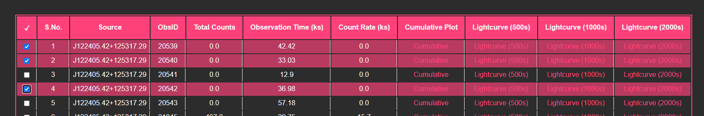

# galaXy.lc
 <a href="LICENSE.txt"></a> <a herf="https://python.org" target="_blank"></a> <a href="https://github.com/psf/black"></a>
  
Build webapps automatically to view and analyse data. All you need are FITS files and a computer.

Features:
- Search bar by coordinates
- Mark sources on your copy of the web app
- Automatic webapp generation - only fits files required
- Compression - all files are minified
- Documentation - code is all documented
- Dark Theme

## Search Bar
- Icon

- Fill field

- Output

(hyperlink to the row)

## Bookmark
- Click checkbox
- The app will save the rows you mark in local storage, on your PC.



- localStorage


## Web App Generation
- Keep files to process in same directory as `main.py` and `htmlcode.py`
- Give answers to the four prompts:

**Example:**
```
  Enter your binnings here (no spaces between commas and numbers): 500, 1000, 2000
  Enter either 'y' or 'n' if you want to delete your files after the webapp has been generated: n
  Enter figure dimensions (l,b) as comma separated values: 15,9
  Enter name of galaxy: M84
 ```
 
- The program will let you know the progress of the processing.
```
1 of 10108 processed
2 of 10108 processed
3 of 10108 processed
4 of 10108 processed
```
- All styling and scripting is included in the `htmlcode.py` file
- Once the process is complete you will receive this message:
```
Your webapp is ready to go! Open index.html to see it in action!
Total runtime of the program was 300.62743496894836
```
The runtime is in seconds (this was for 81 files in 3 different binnings)

- Open `./app/index.html` once you get this message. The web app will be displayed in your default browser.

## Acknowledgements
If you use galaXy in your research, please acknowledge it as so:

### Avaialable galaXy web apps
```tex
This work has made use of the data products of {\it galaXy} (\url{https://github.com/sammarth-k/galaXy}), developed by Sammarth Kumar.
```
 
### Software
```tex
This work has made use of the {\it galaXy} (\url{https://github.com/sammarth-k/galaXy}), developed by Sammarth Kumar.
```
 
### Both
```tex
This work has made use of the {\it galaXy} (\url{https://github.com/sammarth-k/galaXy}) software and its data products, developed by Sammarth Kumar.
```
 
## FAQs
#### 1. Is the app connected to a database?
No, the metadata is stored as a list of dictionaries (Python), which is later passed on the the JavaScript as an array of collections (equivalent of list and dictionary). Figures are stored on your device in ./app/images

#### 2. Will the rows I bookmark show on someone else's copy?
No, the row numbers are saved in `localHost` and hence only on your device. You could share the key-value to someone. The key is `"marked"` and value will vary.
An input field for bookmarks is however a possible feature for a future version

#### 3. Are there any server functions?
No, all data is stored and all scripts are run on the user's device

#### 4. Is this program only for FITS files
Yes, but it can be modified to accomodate txt files as well

#### 5. How fast is the program?
The speed of the program varies based on the total number of plots required to be generated.

#### 6. How big is the app?
The app can become huge for large datasets. That's why in the `main.py` file I added a line to ignore plotting files with low photon counts to save space and also time.

## Updates
1. 23 April 2021: Drastic reduction in memory consumption
2. 30 April 2021: Code optimization
